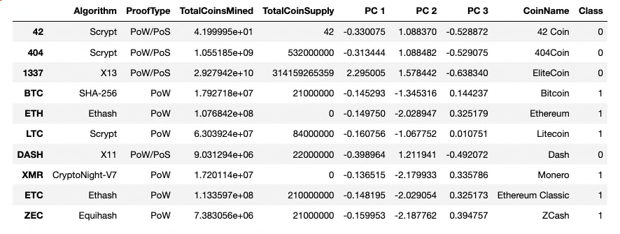
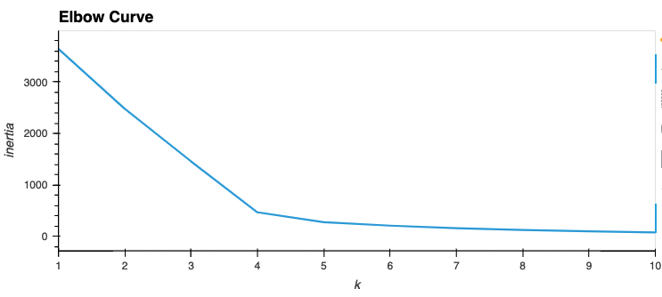
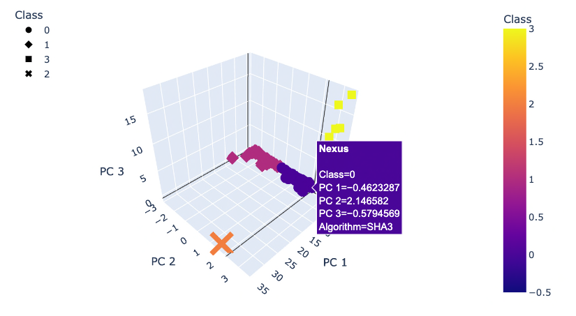
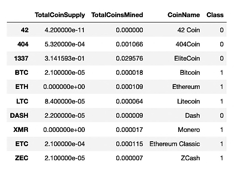
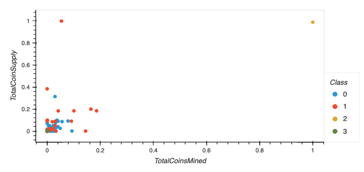
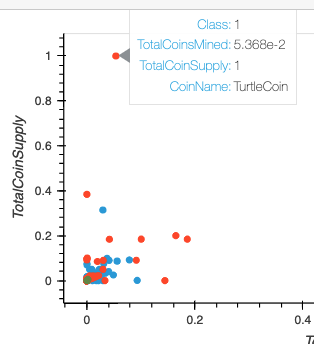
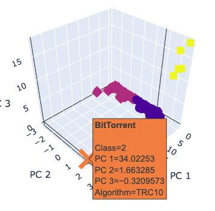
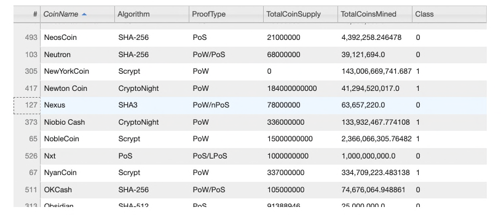

# Cryptocurrencies

## Overview

Given a dataset from CryptoCompare, this project creates a report that includes what cryptocurrencies are on the trading market and how they could be grouped to create a classification system for a new cryptocurrency investment portfolio.

The data was processed to fit the machine learning models. Since there is no known output for the portfolio, the project uses unsupervised learning to group the cryptocurrencies with a clustering algorithm.

The data was then used to create the visualizations shown in this report.

## Results

The following images show the results from cleaning up the data and running our models.

- Clustered DataFrame

  This clustered dataframe includes the principal components that were used for the elbow curve. The model was created running K-Means with k=4.

    

- Elbow Curve

  This graph shows the elbow curve using only the principal components before the columns were added to the dataframe above:

    

- 3D Scatter Plot

  The image below shows a 3D scatter plot of the clustered data in the dataframe shown previously:

  Note that there are 4 clusters with 2 clusters containing very few data points and 2 others that contain many datapoints:

    

  Also note that Nexus coin is highlighted to show the principal components, class and algorithm used when the cursor is hovered over a datapoint.

  In this example, Class = 0, PC 1 = 0.46, PC 2 = 2.15, PC 3 = 0.58, and the algorithm used was 'SHA3'.

- Clustered and Scaled DataFrame

  This dataframe shows the TotalCoinSupply, TotalCoinsMined, CoinName and Class, clustered and scaled for normalizing the data for a better comparison:

    

- 2D Scatter Plot

  The following 2D Scatter Plot shows the clustered and scaled data from the dataframe above:

    

- Outlier Bit Torrent

  In these images we can see how the outlier in both models is Bit Torrent:

    

    

## Summary

By using the graphs and tables provided in this analysis, any user can determine which coins may be worthwhile for a diverse portfolio of cryptocurrency that performs well on average.

Open our notebook and use the scrollable table to find out more about your favorite cryptocurrency!

